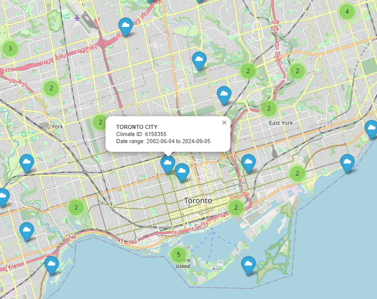
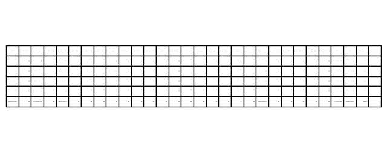
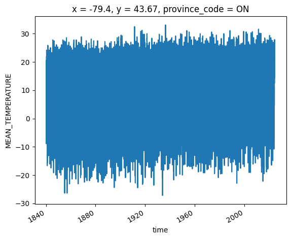

# weather-api

[](https://codecov.io/github/dhah229/weather-api)


This is a Python package that provides a convenient way to fetch weather  and hydrometric station data using the GeoMet OGC API. It simplifies the process of retrieving and parsing the data to `pandas` or `xarray` for  analysis.

## Installation
Clone the library and run (editable)
```
pip install -e .
```

## Usage
Here's a basic example to fetch `HydrometricStations` and `WeatherStations` data. First, if you need to determine which stations you need, you can use the `plot_stations()` method to visualize the stations on a map:
```python
from weather_api import HydrometricStations, WeatherStations

wa = WeatherStations()
# assuming jupyter notebook
wa.plot_stations()
```


You can interact with the map and find out which station ids you need. For this example, we extract two stations from Toronto, ON.
```python
stations = ["6158350", "6158355"]
wa = WeatherStations(stn_id=stations)
ds = wa.to_xr()
ds
```


One of these stations is from the year 1840-2002 and the other is from 2002-2024. We can combine these stations:
```python
temp = ds['MEAN_TEMPERATURE']
combined = temp.sel(climate_identifier=stations[0])
combined = combined.combine_first(temp.sel(climate_identifier=stations[1]))
combined.plot()
```


Note that both `WeatherStations` and `HydrometricStations` have the same API. For hydrometric stations, you can fetch data in the same way:
```python
stations = ['05MH001', '05MH006', '05MJ001']
wa = HydrometricStations(stn_id=stations)
# for a dictionary of dataframes
dcf = wa.to_dict_frame()
# for an xarray
ds = wa.to_xr()
```
The only difference is fetching different timescale data which will be explained later.
Queries can be constrained by specifying the `start_date`/`end_date` and the variables of interest in the constructor:
```python
from datetime import datetime
wa = HydrometricStation(
    stn_id=stations, 
    start_date=datetime(2021, 1, 1), 
    end_date=datetime(2021, 12, 31), 
    vars=["DISCHARGE", "LEVEL"],
)
```
If you require data at a different timescale, you can specify `hourly` for `WeatherStations` and `realtime` for `HydrometricStations` set to `True`. Note that the realtime data for `HydrometricStations` is only available for the last 30 days.
 


