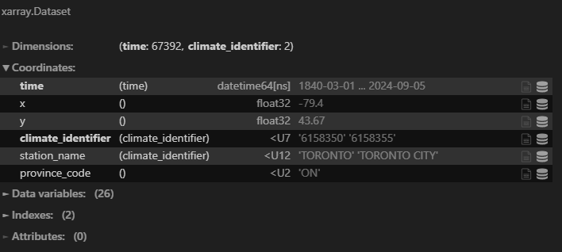
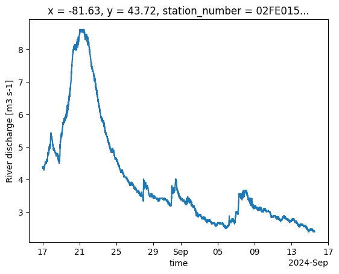
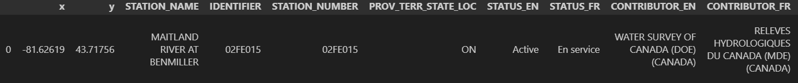

# weather-api

[](https://codecov.io/github/dhah229/weather-api)


This is a Python package that provides a convenient way to fetch weather  and hydrometric station data using the GeoMet OGC API. It simplifies the process of retrieving and parsing the data to `pandas` or `xarray` for  analysis.

## Installation
Clone the library and run (editable)
```
pip install -e .
```

## Usage
Here's a basic example to fetch `HydrometricStations` and `WeatherStations` data. First, if you need to determine which stations you need, you can use the `plot_stations()` method to visualize the stations on a map:
```python
from weather_api import HydrometricStations, WeatherStations

wa = WeatherStations()
# assuming jupyter notebook
wa.plot_stations()
```


You can interact with the map and find out which station ids you need. For this example, we extract two stations from Toronto, ON.
```python
stations = ["6158350", "6158355"]
wa = WeatherStations(stn_id=stations)
ds = wa.to_xr()
ds
```


One of these stations is from the year 1840-2002 and the other is from 2002-2024. We can combine these stations:
```python
temp = ds['MEAN_TEMPERATURE']
combined = temp.sel(climate_identifier=stations[0])
combined = combined.combine_first(temp.sel(climate_identifier=stations[1]))
combined.plot()
```


Note that both `WeatherStations` and `HydrometricStations` have the same API. For hydrometric stations, you can fetch data using the same approach: 
```python
stations = ['05MH001', '05MH006', '05MJ001']
wa = HydrometricStations(stn_id=stations)
# for a dictionary of dataframes
dcf = wa.to_dict_frame()
# for an xarray
ds = wa.to_xr()
```
The time period can be constrained by specifying the `start_date`/`end_date`. Furthermore, you can specify the variables of interest in the constructor:
```python
from datetime import datetime
wa = HydrometricStation(
    stn_id=stations, 
    start_date=datetime(2021, 1, 1), 
    end_date=datetime(2021, 12, 31), 
    vars=["DISCHARGE", "LEVEL"],
)
```
It is possible to extract near real-time hydrometric data by setting the `realtime=True` in the constructor (Note that real-time data is only available for the last 30 days). 
For climate data, the `hourly=True` returns the hourly timescale data. For example:
```python
station = "02FE015"
wa = HydrometricStation(
    stn_id=station, 
    realtime=True,
)
ds = wa.to_xr()
ds["DISCHARGE"].plot()
```


To see the endpoint that the api is trying to reach, use the `url` accessor:
```python
wa.url
```
which returns 
```
['https://api.weather.gc.ca/collections/hydrometric-realtime/items?f=csv&limit=1500000&startindex=0&STATION_NUMBER=02FE015&sortby=DATETIME']
```

To view the associated metadata for a chosen station(s), use the `get_metadata()` method (e.g., `wa.get_metadata()`) which returns a `pd.DataFrame`:

